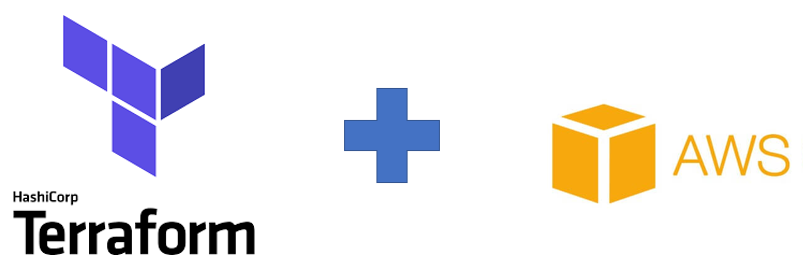

# SEGLAB01
Laboratório 01 - Testando o conceito de orquestração com Terraform + AWS 

# Objetivo

Utilizar a estrutura declarativa do terraform para orquestrar a criação de um servidor web linux rodando Nginx ou Apache encapsulados em containers Dockers;

# Caracteriísticas:

Neste laboratório o terraform fica responsável por gerenciar os seguintes itens:

- Criação da instância usando sistema operacional linux CoreOS
- Deploy do template responsável por configurar o container Docker a partir do CoreOS;
- Criação do grupo de segurança e regras de Inbound e Outbound;
- Criação do endereço ip elástico e vinculo a instância criada;
- Criação do apontamento de DNS e vinculo ao endereço ip criado; 

## Security Groups

O gerenciamento dos grupos de segurança é feito a partir do terraform, o grupo de segurança vinculado a instância possui a seguinte configuração de acessos;

- Restrição de acesso à porta 22 utilizada pelo protocolo SSH;
- Liberação de acesso à porta 80 usada pelo servidor de conteúdo nginx ou apache;
- Liberação de ICMP;

## Object Storage

No uso de S3 ou soluções similares, existe o conceito de Object Storage, isto é: Um modelo de armazenamento onde os dados são manipulados como objetos;

**Object Storage Policys**

Conforme descrito no capítulo sobre autorização e autenticação, no uso de soluções baseadas em Cloud Computing temos o conceito de Policys,  a partir de uma policy é possível liberar o acesso a uma conta para um objetivo específico, como adicionar ou visualizar objetos em um Bucket (nome dado aos diretórios criados para armazenar objetos).

Com base neste conceito a conta utilizada para este laboratório possui as seguintes premicias:

- Neste exemplo a conta foi criada no formato "Programatic Account", uma conta usada para administração via API e sem acesso ao painel de gerenciamento, essa escolha de tipo de conta visa restringir o vetor de ataque;

- Esta conta será manipulada pelo terraform, que foi a solução de orquestração adotada no exemplo;

- O terraform foi configurado para guardar o estado dos recursos manipulados (criação de instâncias, Elastic IPs etc.) em um bucket usando como mecanismo de autenticação a nossa "Programatic Account" e como mecanismo de autorização uma Policy de acesso ao Bucket similar a policy deste exemplo;

- A autorização nas policys se baseia na identificação das contas que no caso da AWS são chamadas de  (ARNs) ou Amazon Resource Names;